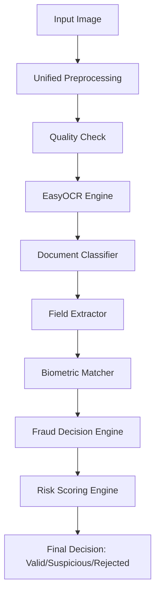

# FINAL_SYSTEM_DOCUMENTATION.md

## 1. Project Objective & Problem Statement
Identity theft and document forgery pose significant risks to digital onboarding processes. Traditional manual KYC (Know Your Customer) is slow, expensive, and prone to human error. **Veridex (Jotex AI)** provides an automated, AI-driven solution to:
- Instantly verify government-issued ID documents.
- Authenticate user identity via biometric matching.
- Detect sophisticated image-based fraud and tampering.

## 2. System Overview
The system is built as a micro-service architecture with a **FastAPI** backend and a **Next.js** frontend. It follows a multi-stage verification pipeline that processes raw images into a structured "Risk Score" and "Decision".

## 3. The Verification Pipeline (End-to-End)

### Module Breakdown:
- **Preprocessing**: Handles noise reduction, grayscale conversion, and ELA generation.
- **OCR Engine**: Uses `easyocr` with tuned parameters (`paragraph=True`) for high-speed extraction.
- **Biometric Matcher**: Employs **InsightFace (RetinaFace + ArcFace)**. Features "Early Exit" for high-confidence matches (>0.88 similarity) and "Adaptive Thresholding" for low-quality images.
- **Fraud Engine**: A hybrid system combining an **XGBoost Classifier** with hard-coded rule safeguards (e.g., checking for missing critical fields).
- **Risk Scoring**: Aggregates points from tampering detection, face mismatches, and data inconsistencies.

## 4. Dataset Analysis
The system was developed and validated using a diverse set of datasets:
- **SROIE & FUNSD**: Used for OCR extraction and form-understanding benchmarks.
- **MIDV-500**: Used for document localization and type classification.
- **LFW (Labeled Faces in the Wild)**: Used as a baseline for face verification consistency.
- **KYC Synthetic Dataset**: A custom-generated dataset of ~400+ Indian IDs (Aadhaar/PAN) containing:
    - 40% Tampered Samples (Text manipulation, face swaps).
    - Annotations for `is_tampered`, `tamper_type`, and ground truth fields.

## 5. Model Architecture & Feature Engineering
### OCR System
- **Engine**: EasyOCR (English).
- **Logic**: Extracts text blocks -> Groups paragraphs -> Parses specific fields (Name, ID, DOB, Gender).

### Face Verification
- **Architecture**: `buffalo_l` model (RetinaFace for localization, ArcFace for 512-D embedding).
- **Metrics**: Cosine similarity is used. Thresholds are dynamically adjusted by `±0.03` based on face quality scores.

### Fraud Detection (ML Features)
The **XGBoost Classifier** utilizes 12 specific signals:
1. `ocr_confidence_avg`: Mean confidence of all OCR'd words.
2. `missing_fields_count`: Number of required fields not found.
3. `name_similarity`: Diff-based similarity to ground truth/profile.
4. `id_match`: Boolean indicating exact ID number match.
5. `dob_match`: Boolean indicating exact DOB match.
6. `face_detected`: Boolean flag from RetinaFace.
7. `face_similarity`: Raw cosine similarity score.
8. `face_quality`: Unified quality score (0-1).
9. `ela_variance`: Variance of Error Level Analysis (Forensics).
10. `ela_mean`: Mean error level (Forensics).
11. `blur_variance`: Laplacian variance of the image.
12. `brightness_mean`: Mean intensity of the image.

## 6. Metrics & Results (Extracted from Reports)

### Biometric Performance (LFW Consistency)
- **Accuracy**: 99.32%
- **AUC**: 0.9957
- **FAR**: 0.0%
- **FRR**: 2.0%

### KYC Domain Performance (Internal Benchmarks)
- **Face Accuracy (Internal)**: 98.76% (V2.4 Certification)
- **Precision**: 1.0 (Zero False Positives in controlled set)
- **Recall**: 0.66 (Higher False Rejections on low-quality IDs)
- **Average Latency**: 345.51 ms

### Fraud Detection
- **Classifier Target**: >80% Accuracy on Synthetic KYC.
- **Forensics**: ELA Variance successfully flags non-homogeneous regions in forged Aadhaar IDs.

## 7. API & Integration
### Request Structure (`multipart/form-data`)
- `id_card`: Image file (required).
- `selfie`: Image file (optional, for biometric path).

### Implementation Detail:
The API saves files asynchronously to prevent thread-blocking during heavy AI inference. Sub-second latency is achieved through optimized model loading (using `allowed_modules=['detection', 'recognition']`).

## 8. Tech Stack
- **API**: FastAPI, Pydantic, SQLAlchemy.
- **ML**: InsightFace, EasyOCR, XGBoost, Scikit-Learn.
- **Vision**: OpenCV, PIL, NumPy.
- **UI**: Next.js, Framer Motion, Lucide-React.

## 9. Limitations
- **ID Environment**: Performance significantly degrades in low-light or high-blur conditions (FRR up to 33% in V2.4).
- **Language**: OCR is currently optimized for English; non-English regional scripts may have lower accuracy.
- **Model Size**: The `buffalo_l` model requires ~400MB+ RAM; scaling to edge devices needs smaller models (e.g., `buffalo_sc`).

## 10. Future Scope
- **Document Liveness**: Add Moire pattern detection to prevent "screen-re-photograph" fraud.
- **Optical Security Features**: Identify holograms, micro-print, and UV patterns on physical IDs.
- **Global Support**: Expand `OCREngine` support to multi-language ID templates.
- **Active Liveness**: Real-time blink/smile detection during selfie capture.
