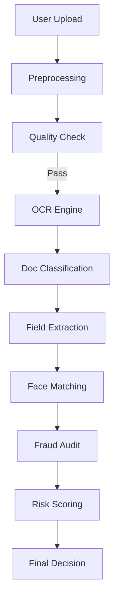

# System Architecture & Technical Documentation

## 1. Introduction
The Document Fraud Detection System is an end-to-end verification platform designed to automate the KYC (Know Your Customer) process while maintaining high security against digital tampering and identity theft.

## 2. System Architecture

### 2.1 Component Overview
The system is built on a modular architecture:

- **Ingestion Layer**: Handles file uploads (Images/PDFs) via FastAPI.
- **Preprocessing Layer**: Normalizes images, checks quality (blur/lighting), and handles PDF-to-Image conversion.
- **Extraction Layer (OCR)**: Uses `EasyOCR` to extract text from PAN and Aadhaar documents.
- **Verification Layer**:
  - **Document Classification**: Identifies the document type based on OCR keywords.
  - **Field Extraction**: Regex-based extraction of Name, DOB, and ID numbers.
  - **Face Matching**: Compares the ID photo with a user selfie using a 512-D embedding model (ResNet18).
- **Fraud Layer**:
  - **Tampering Detection**: Analyzes compression artifacts via Error Level Analysis (ELA).
  - **pHash Matching**: Identifies duplicate images using Perceptual Hashing.
  - **Logical Consistency**: Flags discrepancies between multiple documents (e.g., name mismatch).
- **Decision Layer**: A heuristic-driven scoring engine that issues a final "CLEAR", "CAUTION", or "REJECT" decision.

### 2.2 Data Pipeline Flow

## 3. Design Decisions

### 3.1 OCR Framework: EasyOCR
Chosen for its robust support for English and Indian languages and its ability to handle varied lighting conditions without extensive retraining.

### 3.2 Face Matching: ResNet18 + Haar Cascades
We utilize a ResNet18 backbone pretrained on ImageNet as a feature extractor. While not a dedicated face model like FaceNet, it provides a lightweight and efficient similarity metric when combined with Haar Cascade face detection.

### 3.3 Database: SQLite
We use SQLite for the current version for portability and ease of setup. It stores verification records, risk scores, and file paths for auditing.

## 4. API Flow
1. **POST `/verify`**: Accepts ID card and Selfie. Returns a `tracking_id` and initial results.
2. **GET `/records`**: Lists all past verifications.
3. **GET `/records/{tracking_id}`**: Retrieves detailed audit results for a specific case.

## 5. Security & Fraud Logic
- **ELA**: Detects if specific regions of an image have been modified by checking the JPEG compression consistency.
- **pHash**: Prevents "re-submission fraud" by checking if the image has been seen in the system before, even if slightly resized or compressed.
